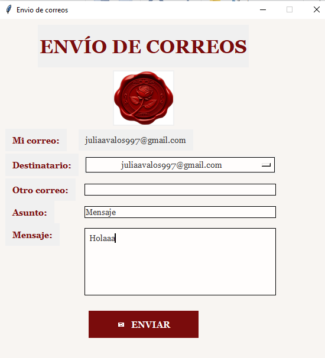
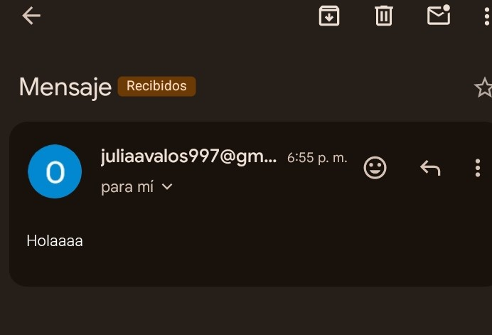

 Trabajo Práctico N°2: Interfaz Gráfica de Usuario (GUI) y GitHub Fork

Materia: Laboratorio de Programación
Alumna: Julia Oriana Denise Avalos
Se trabajo a base de un Fork de LuisOchoa1495/Python-Tkinter

---
**Descripción del Proyecto**
Aplicación desarrollada en Python para el envío de correos electrónicos mediante una Interfaz Gráfica de Usuario (GUI) 
construida con Tkinter y conectada al protocolo seguro `SMTP_SSL` de Gmail.

---

Algunas modificaciones realizadas son :
1. **Rediseño Visual**: Cambio de colores (`#F8F5F2` y `#7A0C0C`), tipografía `Georgia` y organización con `.grid()`.
2. **Multimedia**: Carga y ajuste de imagen institucional mediante la librería `Pillow` (`PIL.ImageTk`).
3. **Selección de Destinatarios**: Implementación de menú desplegable (`OptionMenu`) con correos de docentes y compañeros, más un campo de entrada libre (`Entry`).
4. **Validaciones y Seguridad:** Mensajes emergentes (`messagebox`) de control de campos obligatorios y manejo de excepciones de autenticación SMTP.

---

Tecnologías Utilizadas
**Lenguaje**: Python 3.x
**Interfaz Gráfica**:Tkinter / Pillow (PIL)
**Protocolo**:`smtplib` (`SMTP_SSL`) / `email.message`
**Compilador**: PyInstaller

---

 Capturas de Pantalla

**Interfaz Gráfica Principal**

** Confirmación de Envío**

---
 **Ejecutable**
El archivo compilado `.exe` se encuentra disponible en la carpeta `/output`.
